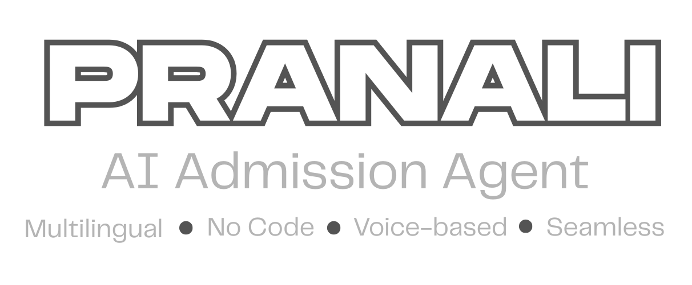
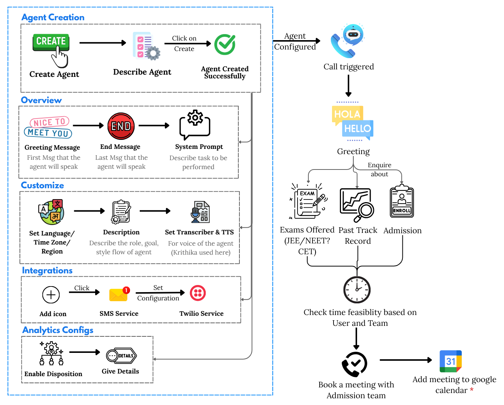

  

**An AI-powered voice assistant built on the Inya.ai platform to automate and streamline the admissions inquiry process for educational institutions.**

This project features a specialized conversational agent, named **Pranali**, designed to handle a wide range of admissions-related queries, provide information on courses and fees, and intelligently schedule meetings with the admissions team.

## ✨ Key Features

- **Intelligent Inquiry Handling:** Answers common questions about courses (JEE, NEET, CET), fees, and the institution's track record.
- **24/7 Availability:** Provides constant support to prospective students and parents, ensuring no inquiry is missed.
- **Automated Meeting Scheduler:** Integrates directly with a **Google Calendar** to check team availability and book one-on-one meetings.
- **Persona-Driven Interactions:** Maintained a friendly and approachable tone to create a positive user experience.
- **Robust Integrations:** Configurable with services like **Twilio** for SMS notifications and tracking call outcomes with **Disposition** analytics.

## 🚀 How It Works

The agent follows a seamless, end-to-end call flow:

1.  A user initiates a call to the admissions line.
2.  The agent greets the user and answers their questions based on its knowledge base.
3.  If the user is interested, the agent offers to book a one-on-one meeting with the admissions team.
4.  The agent checks for an available time slot and, upon confirmation, books the meeting in a shared Google Calendar.

  

## 🛠️ Built With

* **Platform:** [Inya.ai](https://inya.ai) (Link to Inya.ai website)
* **Integrations:** Google Calendar, Twilio
* **Analytics:** Disposition Tracking
* **Tools:** Markdown for documentation

## 📖 GitBook Documentation

For a detailed breakdown of the project, including the step-by-step setup, configuration, and a deep dive into the call flow, please visit our GitBook documentation.

[**View Project Documentation**](Link to your GitBook URL)

## 🤝 Let's Connect

We're proud of this project and the potential it holds for modernizing admissions processes. We'd love to hear your thoughts!

* **LinkedIn:** [Your LinkedIn Profile URL]
* **Email:** [Your Email Address]

Give our project a star ⭐ on this repo and a like on our [LinkedIn post](Link to your LinkedIn Post)!
